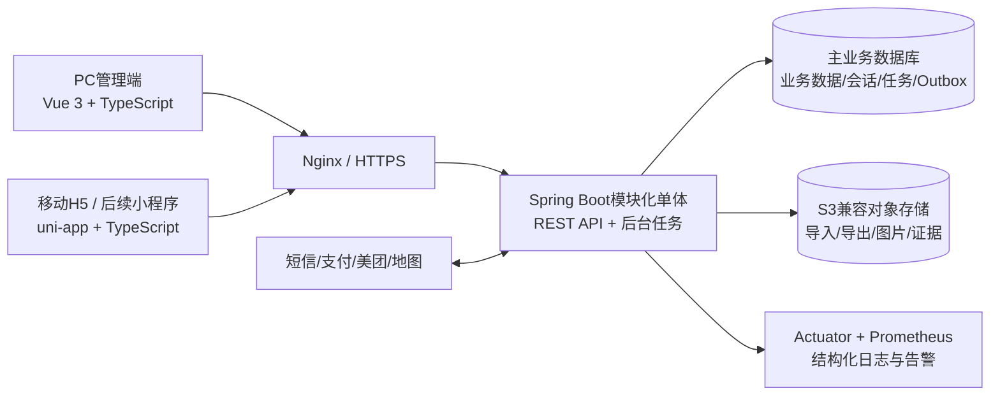

# 悦·指间管理系统技术实施计划

| 文档属性 | 内容 |
| --- | --- |
| 文档版本 | V1.2 |
| 编制日期 | 2026年7月29日 |
| 适用周期 | 2026年7月29日—2026年8月28日及后续迭代 |
| 计划状态 | 已结合甲方旧源码初审结果调整，主重构版本待M0确认 |
| 关联文档 | `docs/项目总计划.md`、两份系统功能清单 |

## 一、技术目标和硬性决策

本计划的目标是在一个月交付窗口内形成可运行、可测试、可迁移、可上线并能继续迭代的系统，不以搭建复杂技术平台为目标。

甲方旧源码初审确认其为Java 6、Struts、Spring、Hibernate和SQL Server技术栈的部署包，包含1021个JSP页面以及大量已编译业务JAR，但压缩包末尾损坏，缺少完整构建文件、`web.xml`和部分运行依赖。旧包可以用于页面、Action、Hibernate映射和数据关系分析，不能直接作为新系统工程继续开发。

因此，技术实施遵循以下原则：

- 先运行比较齐总版和钇休版，选择其中一个作为唯一主重构版本。
- 旧JSP、`.do`入口、Hibernate映射和原系统操作只作为需求还原依据。
- 新系统不得依赖旧业务JAR、Class、硬编码服务器目录和历史密钥。
- 主版本已经稳定实现的框架和模块优先复用，不为套用本计划重新推倒。

以下内容作为首版硬性基线：

1. 使用一个Git仓库管理后端、PC管理端、移动端、部署和测试，减少跨仓库版本不一致。
2. 后端采用模块化单体，不在首月拆微服务；模块间通过Java接口和本地领域事件协作，不通过内部HTTP互调。
3. 首版数据库确定为SQL Server 2022。开发环境使用Developer Edition；生产版按甲方许可证确定。新业务库与恢复后的旧库分开，新库结构只允许通过Flyway Migration修改。
4. PC端和移动端前后端分离，通过同一套REST API及OpenAPI契约协作。
5. 选定的主业务数据库是唯一业务事实来源。首月不引入Elasticsearch、Kafka、Redis集群、数据仓库和Kubernetes。
6. 大文件、报表和导出结果进入S3兼容对象存储；数据库只保存文件元数据和对象键。
7. 异步任务使用数据库任务表和事务Outbox，确保任务可追踪和可重试；性能验证表明需要后再引入消息队列。
8. 所有数据库变化使用Flyway版本脚本，所有API变化更新OpenAPI，所有架构变化使用ADR记录。
9. 两份需求推荐落在同一业务平台和同一模块体系中，按功能开关、角色权限和发布批次区分，不复制建设两套会员、预约、账单和统计内核。只有在M0确认既有V3系统无法合并时，才通过适配层连接旧系统。

数据库选择及取舍见[ADR-0001：首版使用SQL Server 2022](decisions/ADR-0001-首版使用SQLServer2022.md)。

## 二、推荐技术栈

### 2.1 技术选型表

| 层级 | 选型 | 首版版本基线 | 用途与选择理由 |
| --- | --- | --- | --- |
| 后端语言 | Java（OpenJDK） | Java 21 LTS，使用Eclipse Temurin或同等OpenJDK发行版 | 生态成熟、当前本机可直接安装，适合一个月项目；禁止使用预览特性 |
| 后端框架 | Spring Boot | 3.5.16 | 兼容Java 21且生态成熟；一个月项目优先兼容性，首版不直接上Spring Boot 4 |
| 安全与会话 | Spring Security + Spring Session JDBC | 跟随Spring Boot依赖管理 | 使用数据库会话和安全Cookie，便于统一PC/H5登录、强制失效和审计，避免首版自行实现JWT撤销机制 |
| 数据访问 | MyBatis Spring Boot Starter | 3.0.x | SQL显式，便于对照旧Hibernate映射、复杂统计和数据权限 |
| 数据库迁移 | Flyway | 跟随Spring Boot兼容版本 | 版本化管理DDL、索引、基础枚举和可重复视图，禁止手工改生产结构 |
| 构建工具 | Maven Wrapper | Maven 3.9.x | 后端依赖、测试和构建统一，开发机不依赖全局Maven版本 |
| PC前端语言 | TypeScript | 5.x，锁定精确版本 | 静态类型减少表单、金额、状态和API字段错误 |
| PC前端框架 | Vue 3 + Vite | Vue 3.x；Vite使用初始化时稳定版 | Vue官方支持TypeScript和Vite，适合快速建设管理后台 |
| PC组件与状态 | Element Plus、Pinia、Vue Router、ECharts | 初始化时锁定精确版本 | 表格、表单、权限菜单、状态管理和经营图表 |
| 移动端 | uni-app + Vue 3 + TypeScript | 初始化时稳定版 | 共用Vue和TypeScript能力；首月交付H5，微信小程序/App只有在M0明确验收平台并提供账号时才同时构建 |
| Node运行时 | Node.js | 24 LTS | 仅用于前端构建和工具链；不承载核心后端业务 |
| 前端包管理 | pnpm | 10.x，根目录锁定精确版本 | 管理多个前端应用和共享API客户端，必须提交锁文件 |
| 主数据库 | SQL Server | 2022；本地Developer Edition | 原系统就是SQL Server，可直接利用旧Hibernate映射和备份，减少跨库迁移及统计SQL重写风险 |
| 对象存储 | S3兼容存储，开发/私有部署使用MinIO | 锁定镜像摘要 | 保存导入文件、导出报表、图片和审计证据；生产也可替换为云厂商OSS/S3 |
| 网关与静态资源 | Nginx | 稳定版，锁定镜像摘要 | HTTPS、同源路由、静态文件、反向代理、请求大小和超时控制 |
| 容器与编排 | Docker + Docker Compose | Compose v2 | 本地、测试、预生产和首版单机生产保持一致；首月不引入Kubernetes |
| 自动化测试 | JUnit 5、AssertJ、Testcontainers、Vitest、Playwright、k6 | 跟随各项目锁定版本 | 覆盖后端事务、真实主数据库集成、前端单测、业务闭环E2E和性能基线 |
| 可观测性 | Spring Boot Actuator、Prometheus、Grafana、JSON结构化日志 | 锁定镜像摘要 | 健康检查、JVM/数据库连接池/API指标、告警和请求追踪 |
| CI/CD | GitHub Actions | 仓库工作流版本固定到提交SHA | 执行格式、静态检查、测试、构建镜像、漏洞扫描和环境发布 |

### 2.2 版本锁定规则

1. Java、Node、主数据库和Spring Boot锁定主版本；构建文件和容器镜像锁定精确版本或镜像摘要。
2. `pom.xml`、`pnpm-lock.yaml`、Maven Wrapper和`packageManager`字段必须提交仓库。
3. 首月只接收安全补丁和阻断缺陷修复，不进行框架主版本升级。
4. 后续升级先在 `plan/decisions/` 提交ADR，说明兼容、迁移、回滚和测试结果。

## 三、总体架构



### 3.1 部署单元

首版只有以下部署单元：

1. `frontend`：PC管理端，编译为静态资源后由Nginx托管。
2. `mobile`：编译为H5静态资源，由Nginx托管。
3. `server`：一个Spring Boot可执行JAR/容器，同时承载API和受控后台任务。
4. `database`：业务数据库、登录会话、任务队列和Outbox。
5. `object-storage`：文件对象存储。
6. `nginx`：统一域名、HTTPS及反向代理。
7. `prometheus/grafana`：生产监控；本地开发可按需启动。

系统必须先在单实例上正确运行。只有实测容量超过单实例或提出高可用SLA时，才增加Server副本、数据库高可用和Redis兼容缓存；扩容不能改变主业务数据库作为事实来源的原则。

### 3.2 旧系统模块对应关系

旧目录名继续用于检索，不直接沿用旧包结构：

| 旧系统目录/JAR | 主要内容 | 新系统模块 |
| --- | --- | --- |
| `security`、`application_security.jar` | 用户、角色、菜单、权限、日志 | `iam`、`audit` |
| `hr`、`biz` | 门店、组织、员工、职务、提成 | `organization`、`commission` |
| `customer`、`charge` | 会员、储值、积分、次卡、券、回访 | `member`、`asset`、`visit`、`marketing` |
| `oe`、`bill` | 预约、开单、结算、到家服务 | `appointment`、`trade`、`settlement`、`homeservice` |
| `item`、`inv` | 产品、服务、设备和库存 | `catalog`、`inventory` |
| `stat`、`stat20` | 营业、会员、员工及财务统计 | `reporting` |
| `message` | 短信、消息模板和发送记录 | `marketing`、`notification` |
| `fnd`、`system`、`datatranfer` | 系统设置、字典、文件和数据导入 | `catalog`、`filejob` |
| `weixin`、`pay`及外部URL配置 | 微信、支付、短信等外部系统 | `integration` |

### 3.3 模块边界

| 模块 | 拥有的核心数据与职责 |
| --- | --- |
| `iam` | 用户、角色、权限、会话、密码策略、登录日志 |
| `organization` | 公司、门店、部门、员工、职务、工位、借调与数据范围 |
| `catalog` | 产品、物料、服务项目、次卡类型、付款方式、服务小区和基础枚举 |
| `inventory` | 礼品、产品库存、出入库、盘点和设备领用记录 |
| `member` | 会员档案、等级、标签、归属、服务偏好、特殊/冻结状态 |
| `appointment` | 排班、时段、预约、候补、爽约和预约状态机 |
| `trade` | 开单、订单明细、技师分配、结账状态、作废和业务单号 |
| `asset` | 储值、积分、次卡、代金券、服务码及不可变资产流水 |
| `settlement` | 支付组合、退款、冲销、调账、对账和幂等处理 |
| `commission` | 提成方案、工资、分润、目标、负向调整和计算快照 |
| `visit` | 邀约、回访、服务分析、咨询卡和客诉跟进 |
| `marketing` | 短信任务、触达人群、满意度、券码活动和发送结果 |
| `homeservice` | 服务小区、到家订单、定位、派单和状态同步 |
| `reporting` | 统计查询、经营看板、日报快照、异步报表和下载中心 |
| `notification` | 站内消息、消息模板、触发记录和发送状态 |
| `integration` | 短信、支付、美团、地图等第三方适配器和回调入口 |
| `filejob` | 文件元数据、导入导出任务、任务重试、Outbox和定时任务 |
| `audit` | 操作审计、敏感操作、数据变更摘要和证据引用 |

模块只能直接写自己拥有的表；跨模块写入必须调用目标模块的Application Service。`reporting`可读取经批准的查询视图或投影，但不得反向修改业务表。

### 3.4 模块内部结构

每个模块采用相同的轻量分层，避免一月项目出现过度设计：

```text
module-name/
├── api/              # Controller、请求/响应DTO、OpenAPI注解
├── application/      # 用例服务、事务边界、权限编排
├── domain/           # 业务对象、规则、状态机、领域事件
└── infrastructure/   # MyBatis Mapper、第三方适配、持久化实现
```

Controller不得直接调用Mapper；数据库实体不得直接作为API响应；第三方SDK只允许出现在`integration`或模块的`infrastructure`中。

## 四、数据库与交易一致性规则

### 4.1 数据库基线

1. 表和字段使用小写 `snake_case`；Java和JSON字段使用 `camelCase`。
2. 主键使用数据库原生的 `bigint` 自增或序列；对外使用不可猜测的业务编号，如订单号、支付号、任务号和券码。
3. 多门店业务表必须按适用范围包含 `biz_org_id`、`store_id`，并建立与高频查询匹配的联合索引。
4. 通用审计字段统一为 `created_at`、`created_by`、`updated_at`、`updated_by`、`row_version`；并发修改使用SQL Server `rowversion` 乐观锁。
5. 时间点统一保存到毫秒并按UTC处理，界面按 `Asia/Shanghai` 展示；营业日、工资月等业务期间使用独立日期字段。
6. 金额和可拆分数量使用 `decimal(19,4)`，比例使用 `decimal(9,6)`；Java一律使用 `BigDecimal`，禁止 `float/double` 计算金额。界面通常展示两位金额，但数据库保留四位计算精度。
7. 状态使用可读字符串编码并通过检查约束或字典约束；禁止把重要状态只存在前端。
8. 历史交易、资产流水、审计日志不得物理删除；基础资料通过状态和生效区间停用。

### 4.2 资产与财务规则

1. 储值、积分、次卡、券、支付、退款、提成均使用“当前账户/快照 + 不可变流水”模型，任何余额变化必须对应唯一流水。
2. 结算、扣次、退款、冲销、调账及相关流水在一个本地数据库事务内完成；失败必须整体回滚。
3. 外部支付回调、短信回执、导入任务和用户重复提交必须使用唯一幂等键；重复请求返回原结果，不重复扣减。
4. 外部通知使用事务Outbox：业务事务同时写业务数据和Outbox，后台任务再投递第三方；禁止在未提交事务中直接调用外部接口。
5. 调账和冲销只增加反向流水和新版本记录，不覆盖原账单或原提成结果。
6. 每次薪酬/提成计算保存规则版本、输入快照、计算明细和结果，保证历史工资可重算、可解释。
7. 所有关键规则先建立黄金样例测试，再编写实现；没有确认样例的复杂金额功能不得标记完成。

### 4.3 Flyway规则

1. 后端同时引入 `flyway-core`、`flyway-sqlserver`和微软JDBC驱动；Flyway只连接新业务库 `yuezhijian_dev`，绝不连接只读旧库。
2. SQL文件统一放在 `backend/src/main/resources/db/migration/`，命名为 `VYYYYMMDDHHMM__description.sql`，例如 `V202607291430__create_member_tables.sql`。
3. 一次结构调整对应一个版本文件。建表、改字段、建索引、约束和基础字典变化都必须写SQL，禁止手工修改共享数据库。
4. Flyway自动使用 `dbo.flyway_schema_history` 记录版本、脚本名、校验值、执行人、执行时间和执行结果；业务代码不得直接修改这张表。
5. 已在任一共享环境执行过的版本文件禁止修改或删除。后续发现问题时新增更高版本的修复SQL，保证所有环境按同一历史升级。
6. `R__*.sql`只用于可重复生成的视图和存储过程，不用于业务表和普通数据；测试种子数据只进入本地/测试环境。
7. 应用启动前执行 `flyway validate`，再执行 `migrate`；生产环境禁用 `clean`和自动基线，Migration失败时停止发布。
8. 破坏性变更分“新增替代字段 → 迁移数据 → 切换代码 → 后续版本删除旧字段”执行，不能在一个版本中直接删列。
9. 每个SQL文件在合并前必须在空库和上一版本库各执行一次，并附查询验证；生产发布前先备份，再执行Migration。

### 4.4 老系统数据迁移

本地和测试环境使用同一个SQL Server实例、两个独立数据库：

- `yuezhijian_legacy`：从甲方备份恢复，只读保存，不执行Flyway，不修改原始数据。
- `yuezhijian_dev`：新系统开发库，所有结构由Flyway从空库创建。
- 自动化测试使用独立的 `yuezhijian_test`，每次测试从Migration重新建库。

旧源码中已识别约473份Hibernate表映射，核心表以 `CST_`、`OE_`、`HR_`、`ITEM_`、`INV_`、`SEC_`、`FND_` 为主。迁移程序按“旧表读取 → 字段转换 → 新表写入 → 数量及金额对账”执行，不直接复制整张旧表。

新库首批建立以下迁移记录表：

| 表 | 记录内容 |
| --- | --- |
| `migration_batch` | 批次号、旧备份校验值、源码提交号、开始/结束时间和最终状态 |
| `migration_step` | 每类数据的源表、目标表、读取数、写入数、跳过数和失败数 |
| `migration_error` | 旧主键、错误字段、错误原因、原始值摘要和处理状态 |
| `migration_reconciliation` | 会员数、余额、积分、次卡、账单、支付等对账项及差异 |
| `legacy_id_map` | 数据类型、旧主键和新主键的对应关系，供关联数据迁移使用 |

旧映射中金额同时出现 `Integer`和`Double`，不能直接判断是元还是分。拿到真实备份后必须抽样确认金额单位、精度、空值和负数规则，再编写转换SQL。每个迁移批次必须可重复执行，同一旧主键不得重复生成新数据。

## 五、API、权限与安全基线

### 5.1 API规范

1. API前缀统一为 `/api/v1`，按 `/admin`、`/mobile`、`/integration` 划分入口。
2. OpenAPI文件是前后端契约，保存于 `contracts/openapi/`；前端API客户端由契约生成，不手写重复类型。
3. 请求携带或生成 `X-Request-Id`；创建订单、支付、冲销、调账、导入等接口必须支持 `Idempotency-Key`。
4. 错误响应采用Problem Details结构，至少包含 `type`、`title`、`status`、`detail`、`errorCode`、`requestId`。
5. 列表统一使用 `page`、`size`、`sort`，默认限制最大页大小；大数据导出进入异步任务，不允许长连接直接生成。
6. API只返回业务需要的字段；手机号、卡号、工资和金额按权限在后端脱敏，不能依赖前端隐藏。

### 5.2 鉴权与数据权限

1. PC和H5使用Spring Security + Spring Session JDBC；Cookie必须设置 `HttpOnly`、`Secure`、`SameSite`，并启用CSRF保护。
2. 权限编码采用 `模块:资源:动作`，例如 `trade:order:refund`；菜单、按钮和后端接口使用同一权限编码。
3. 后端每个查询和写操作同时检查功能权限与数据范围。数据范围至少支持总部、指定门店、本门店、本人记录。
4. 每个Mapper查询显式接收数据范围并生成过滤条件；自动拦截器只能作为辅助，不能作为唯一越权防线。
5. 第三方回调使用签名、时间戳、防重放和IP/证书策略；密钥只保存在环境变量或CI Secret中。
6. 登录、导出、调账、冲销、审批、短信、权限修改和敏感数据查看必须记录审计日志。

## 六、项目初始目录

后续初始化代码时必须以此目录为基线；新增顶级目录或移动核心模块需要同步更新本计划。

```text
yuezhijian/
├── README.md
├── AGENTS.md
├── .editorconfig
├── .env.example
├── .nvmrc                          # Node 24
├── .gitignore
├── Makefile
├── infra/compose.yaml              # SQL Server、MinIO及可选Redis
├── pom.xml                         # Maven聚合配置（如后续增加Java子模块）
├── pnpm-workspace.yaml
├── package.json                    # 固定pnpm和根级前端脚本
├── pnpm-lock.yaml
├── backend/                        # Spring Boot 后端，后续按业务模块扩展
│   ├── pom.xml
│   └── src/
│       ├── main/
│       │   ├── java/com/yuezhijian/server/
│       │   │   ├── YuezhijianApplication.java
│       │   │   ├── common/
│       │   │   │   ├── audit/
│       │   │   │   ├── config/
│       │   │   │   ├── exception/
│       │   │   │   ├── security/
│       │   │   │   └── web/
│       │   │   ├── iam/
│       │   │   ├── organization/
│       │   │   ├── workbench/
│       │   │   └── modules/       # 后续业务模块按领域逐步加入
│       │   │       ├── catalog/
│       │   │       ├── inventory/
│       │   │       ├── member/
│       │   │       ├── appointment/
│       │   │       ├── trade/
│       │   │       ├── asset/
│       │   │       ├── settlement/
│       │   │       ├── commission/
│       │   │       ├── visit/
│       │   │       ├── marketing/
│       │   │       ├── homeservice/
│       │   │       ├── reporting/
│       │   │       ├── notification/
│       │   │       ├── integration/
│       │   │       └── filejob/
│       │   └── resources/
│       │       ├── application.yml
│       │       ├── db/migration/
│       │       └── mapper/
│       └── test/java/com/yuezhijian/
├── frontend/                       # Vue 3 PC管理端，页面与组件均直接在此开发
│   ├── package.json
│   ├── vite.config.ts
│   └── src/
│       ├── api/
│       ├── components/
│       ├── layouts/
│       ├── modules/
│       ├── router/
│       ├── stores/
│       ├── styles/
│       └── utils/
├── contracts/
│   └── openapi/
│       └── yuezhijian-v1.yaml
├── packages/
│   ├── api-client/                 # 根据OpenAPI生成，禁止手工修改生成文件
│   ├── shared-types/
│   └── frontend-config/
├── tests/
│   ├── e2e/
│   ├── performance/
│   ├── security/
│   └── fixtures/
├── tools/
│   ├── legacy-analysis/            # 旧JSP、Action和Hibernate映射提取
│   ├── data-migration/
│   │   ├── mappings/               # 新旧字段及枚举映射
│   │   ├── sql/extract/            # 只读旧库查询
│   │   ├── sql/reconcile/          # 数量、金额和资产对账
│   │   ├── src/                    # 可断点、可重跑的迁移程序
│   │   └── reports/                # 迁移结果，本地生成文件不提交
│   ├── reconciliation/
│   └── scripts/
├── infra/
│   ├── docker/
│   │   ├── sqlserver/
│   │   └── minio/
│   ├── nginx/
│   ├── monitoring/
│   ├── backup/
│   └── environments/
│       ├── dev/
│       ├── test/
│       ├── staging/
│       └── prod/
├── docs/
│   ├── 项目总计划.md
│   ├── 悦指间门店管理系统.md
│   ├── 悦指间门店管理系统优化功能清单.md
│   ├── api/
│   ├── database/
│   │   ├── legacy-table-map.md
│   │   ├── new-schema.md
│   │   └── migration-runbook.md
│   ├── operations/
│   └── user-guide/
├── plan/
│   ├── README.md
│   ├── 技术实施计划.md
│   ├── 迭代计划模板.md
│   ├── decisions/
│   └── iterations/
├── ref/
│   └── legacy-source/              # 甲方旧系统本地参考资料，必须加入.gitignore
└── .github/
    └── workflows/
        ├── ci.yml
        ├── build-image.yml
        └── deploy.yml
```

## 七、本地开发启动方式

当前开发机为Ubuntu x86_64，Docker已安装但当前终端尚未刷新`docker`用户组；Java和Maven未安装，Node.js为20。开始开发前先重新登录使Docker组生效，安装Java 21，并将Node.js切换到24。Maven和pnpm由项目Wrapper/Corepack固定，不依赖个人全局版本。

本地使用官方SQL Server 2022 Developer容器。默认建立 `yuezhijian_dev` 和 `yuezhijian_test`；取得甲方备份后再建立只读的 `yuezhijian_legacy`。数据库密码只放 `.env.local`，仓库只提交 `.env.example`。

根目录 `Makefile` 提供以下统一命令，开发机和CI执行同一套入口：

| 命令 | 行为 | 成功标准 |
| --- | --- | --- |
| `make doctor` | 检查Java 21、Node 24、Docker、Compose、端口和环境变量 | 所有依赖显示通过，缺失项给出明确处理方法 |
| `make bootstrap` | 安装前端依赖、准备Maven Wrapper并生成本地配置 | 不覆盖已有 `.env.local` 和密钥 |
| `make infra-up` | 启动SQL Server 2022和MinIO，Redis按需通过profile启动 | 容器健康，数据卷已挂载，重启容器不丢数据 |
| `make db-info` | 显示Flyway已执行、待执行及失败的Migration | 版本和脚本状态可追踪 |
| `make db-validate` | 校验SQL文件与 `flyway_schema_history` 的版本和校验值 | 无丢失、篡改或重复Migration |
| `make db-migrate` | 对指定的新业务库执行Flyway | Migration全部成功，旧库连接被拒绝写入 |
| `make dev` | 启动Server、PC端和H5，复用已启动的基础设施 | 健康检查通过，可使用本地种子账号登录 |
| `make dev-down` | 停止应用和基础设施 | 默认保留数据库卷，显式参数才允许清理本地数据 |
| `make format` | 格式化Java、TypeScript、Vue、SQL和Markdown | 工作区无格式差异 |
| `make lint` | Java静态检查、ESLint、`vue-tsc`、依赖边界检查 | 0错误 |
| `make test` | 后端单元/集成测试和前端单测 | 0失败 |
| `make e2e` | 启动测试环境并运行Playwright关键闭环 | P0闭环全部通过 |
| `make build` | 构建后端JAR、PC/H5静态资源和容器镜像 | 产物带版本号和Git提交号 |
| `make verify` | 依次执行格式检查、lint、测试、契约检查和构建 | 合并请求必须通过 |
| `make migration-dry-run` | 用脱敏旧库样本执行迁移，不提交生产数据 | 批次、步骤、错误和对账记录完整 |
| `make reconcile` | 对比新旧库关键数量、余额和流水 | 无未解释差异，报告可归档 |
| `make backup` | 执行主数据库和对象存储备份 | 生成校验值、时间和备份清单 |
| `make restore-check` | 在隔离环境恢复最新备份并执行冒烟 | 恢复数据可登录、可查询、关键金额可核对 |

## 八、一个月技术执行计划

### T0：仓库和纵向样板（7月29日—7月31日）

| 日期 | 必做事项 | 当日可验证结果 |
| --- | --- | --- |
| 7月29日 | 审查旧源码；确定SQL Server 2022和Flyway基线；取得并运行两个重构版；补齐工程目录、Compose、环境样例和CI | 数据库决策已记录；主版本可启动；旧源码模块映射和缺失项有记录 |
| 7月30日 | 建立Flyway、统一错误、请求ID、OpenAPI生成、日志、测试框架；完成门店/用户最小表结构 | 一次迁移可创建数据库；前端从OpenAPI生成客户端；CI执行 `make verify` |
| 7月31日 | 完成登录、Session、角色、权限、门店数据范围、审计最小闭环；建立首个纵向样板 | 使用种子账号登录，创建门店基础资料，越权请求被拒绝且有审计日志 |

T0出口条件：主版本、环境、构建、迁移、契约、鉴权和测试链路全部可用。未达到出口条件，不允许并行任务自行创建不同框架。

### T1：公共底座（8月1日—8月5日）

1. 完成组织门店、员工职务、主数据、权限矩阵、敏感字段脱敏和操作审计。
2. 完成统一状态机、幂等组件、Outbox、后台任务、文件上传、异步导入导出和下载中心。
3. 完成PC菜单/路由/权限壳、H5登录/导航壳和共享API客户端。
4. 完成Testcontainers数据库测试基类、Playwright登录与权限用例、测试数据工厂。
5. 完成第一版监控面板、备份脚本和恢复检查脚本。

T1出口条件：两个前端共用同一认证和API契约；公共能力有集成测试；任意新模块可以按样板在半天内创建。

### T2：P0业务闭环（8月6日—8月14日）

四条AI任务流并行执行，人工统一确认规则和测试结果：

| AI任务流 | 后端模块 | 前端范围 | 必须通过的闭环 |
| --- | --- | --- | --- |
| 任务流1 会员预约 | `member`、`appointment`、`visit` | PC会员/预约/回访，H5客户搜索与预约 | 建档 → 预约 → 到店 → 回访 |
| 任务流2 交易结算 | `trade`、`settlement` | PC/H5开单与结算 | 多项目多技师开单 → 混合支付 → 结账 |
| 任务流3 会员资产 | `asset`、`catalog` | 次卡、储值、积分、券和服务码 | 充值/办卡 → 扣减 → 换卡/转赠/退卡 → 流水核对 |
| 任务流4 薪酬平台 | `commission`、`organization`、`audit` | 提成、调账、冲销、审批 | 交易 → 提成 → 调账/冲销 → 负向重算 |

每日要求：上午确认验收样例，下午合入可运行切片，当天测试；金额和状态类缺陷不得累积到下一阶段。

T2出口条件：黄金样例全部自动化；P0闭环E2E通过；余额、卡次数、支付和提成无未解释差异。

### T3：全范围和集成（8月15日—8月21日）

1. 任务流1完成会员增强、标签、短信触达、满意度和服务分析。
2. 任务流2完成调账、冲销、退款、对账、支付适配和小票。
3. 任务流3完成礼品库存、设备、服务码、代金券、到家服务和移动端业务。
4. 任务流4完成统计分析、数据中心、工资、分润、目标、日报和消息通知。
5. 数据迁移任务流完成第一次全量迁移和对账；人工持续回归权限、数据范围和跨端一致性。
6. 8月21日结束前功能冻结；之后只允许缺陷、性能、迁移和上线准备修改。

T3出口条件：需求追踪矩阵全部有版本和测试状态；139项确认范围均已提测；第一次迁移可重复执行。

### T4：RC、迁移和UAT（8月22日—8月25日）

1. 执行全量回归、权限矩阵、敏感信息、并发结算、重复回调、网络失败、兼容和安全测试。
2. 完成第二次迁移演练、关键资产对账、备份恢复演练和回滚演练。
3. 使用真实岗位账号完成UAT；只修复缺陷，不新增功能。
4. 生成RC镜像、SBOM、漏洞扫描报告、发布说明和已知问题清单。

T4出口条件：阻断和严重缺陷为0；UAT签字；迁移无未解释差异；`make restore-check`通过。

### T5：生产上线（8月26日—8月28日）

1. 8月26日完成最终备份、数据库迁移、静态资源和Server灰度发布。
2. 执行登录、会员查询、预约、开单、支付、扣次、冲销、报表、文件和通知冒烟。
3. 8月26—28日持续值守，监控错误率、响应时间、数据库连接、磁盘、任务积压和第三方失败。
4. 达到回滚条件立即停止写入并执行批准的回滚方案，不在生产库临时改数。
5. 8月28日归档版本、镜像摘要、数据库版本、测试证据、迁移报告和验收结果。

## 九、CI/CD和分支规则

1. 使用主干开发：`main`保持可发布，功能分支生命周期不超过2个工作日。
2. 合并请求必须关联需求/任务编号，并通过 `make verify`、代码评审和数据库/API兼容检查。
3. 禁止直接推送 `main`；至少1名模块负责人评审，资产、支付、调账、冲销、权限和迁移代码至少2人评审。
4. CI顺序固定为：格式与静态检查 → 后端/前端单测 → 主数据库集成测试 → OpenAPI兼容检查 → 构建 → 镜像与依赖扫描。
5. `main`合并后自动部署测试环境；发布标签生成不可变镜像；预生产和生产必须人工批准。
6. 数据库迁移先于新应用启动，迁移失败立即停止发布；应用必须兼容当前和上一版数据库的发布过渡方案。

## 十、质量门槛和完成定义

### 10.1 Definition of Ready

功能进入开发前必须具备：需求编号、业务价值、页面/接口、字段、状态、权限、数据范围、异常、黄金样例和验收人。缺任一关键项时保持“未就绪”，不得由开发人员自行猜测财务规则。

### 10.2 Definition of Done

功能只有同时满足以下条件才算完成：

1. 代码合并且模块边界正确；数据库和OpenAPI变更已版本化。
2. 单元、主数据库集成、权限和必要E2E测试通过。
3. 关键日志、指标、审计和错误码齐全，不记录明文密码、Token或完整敏感信息。
4. 在测试环境实际演示验收场景，需求追踪矩阵更新为通过。
5. 发布、迁移和回滚说明已更新；用户可见变化同步操作手册。

### 10.3 首版非功能基线

在甲方未提供更高指标时，首版按以下可执行基线验证：

1. 100个并发在线用户、持续20 RPS下，普通查询P95不超过500ms、普通写入P95不超过1秒、核心结算P95不超过2秒；第三方耗时单独统计。
2. 同一幂等键并发提交不得产生重复订单、重复支付、重复扣次或重复冲销。
3. 单店31天普通统计查询不超过3秒；预计超过3秒的全量统计和导出转为异步任务。
4. 生产错误率低于0.1%，健康检查、数据库连接池、磁盘和任务积压有告警。
5. 主数据库每日全量备份，并按数据库能力保存事务日志或增量备份；目标RPO不超过15分钟、RTO不超过2小时，上线前完成一次隔离恢复验证。
6. 核心金额、资产和提成规则的黄金样例覆盖率100%；后端核心域代码行覆盖率不低于80%，不得用无断言测试凑覆盖率。

## 十一、部署与运维落地

1. 环境至少分为本地、测试、预生产和生产；生产密钥、账号和数据不得复制到开发环境。
2. Compose基础文件放根目录，环境差异放 `infra/environments/{env}`；生产不挂载源代码目录，不暴露数据库和对象存储管理端口到公网。
3. Nginx统一提供HTTPS和同源访问：`/`为PC端、`/m/`为H5、`/api/`转发Server。
4. Server容器使用非root用户、只读根文件系统和独立数据卷；日志写标准输出，审计数据写数据库。
5. 备份必须离开生产主机保存并加密；每次发布前执行数据库和对象存储备份并记录校验值。
6. 发布采用“备份 → 迁移 → 部署 → 冒烟 → 观察”的固定顺序；任何步骤失败都停止后续动作。
7. 首版回滚优先回滚应用镜像；数据库采用向前修复。涉及不可兼容DDL时，必须在发布前提供已演练的恢复方案。

## 十二、后续迭代规则

1. 每个迭代从 `plan/迭代计划模板.md` 创建计划，文件放在 `plan/iterations/`。
2. 迭代编号连续递增，首个工程迭代为 `ITER-00-本地开发基线.md`，后续按业务闭环命名。
3. 每个迭代只接受满足Ready条件的需求；未确认的需求进入待办池，不挤占当前迭代。
4. 迭代结束必须填写实际结果、版本、测试证据和遗留项，不能只更新任务状态。
5. 技术债必须有编号、影响和偿还迭代；临时绕过权限、事务、审计和迁移规则的方案不得合并。
6. 本计划可以调整，但修改必须记录原因、人工确认结论、日期、ADR和迁移/回滚影响。

## 十三、首日必须确认的阻断项

1. 工作流A和V3系统是否共用代码库及数据库；若不共用，旧系统技术栈、接口和数据字典必须交付。
2. 移动端首月验收目标是H5、微信小程序还是原生App；若包含小程序，须立即提供主体和开发者账号。
3. 数据中心缺失的5项明细、所有财务计算黄金样例及历史数据规模。
4. 短信、支付、美团、地图和对象存储的供应商、测试账号、回调域名及网络白名单。
5. 生产部署位置、域名、HTTPS证书、服务器资源、备份目标和允许停机窗口。
6. AI并行任务数量、人工审核时间、燃燃测试时间和上线配合窗口；不足时立即调整并行范围和交付顺序。

## 十四、官方依据

1. [Oracle Java SE支持路线图](https://www.oracle.com/java/technologies/java-se-support-roadmap.html)：Java 21属于LTS版本。
2. [Spring Boot 3.5系统要求](https://docs.spring.io/spring-boot/3.5/system-requirements.html)：3.5系列支持Java 17—25；当前文档版本为3.5.16。
3. [MyBatis Spring Boot Starter](https://mybatis.org/spring-boot-starter/mybatis-spring-boot-autoconfigure/)：3.0系列对应Spring Boot 3.2—3.5。
4. [Vue官方TypeScript指南](https://vuejs.org/guide/typescript/overview)：官方推荐Vue 3、TypeScript和Vite组合。
5. [Node.js发布与LTS说明](https://nodejs.org/en/about/previous-releases)：生产应用应使用LTS版本，Node.js 24当前为LTS。
6. [SQL Server 2022生命周期](https://learn.microsoft.com/en-us/lifecycle/products/sql-server-2022)：SQL Server 2022扩展支持至2033年。
7. [SQL Server Linux容器快速入门](https://learn.microsoft.com/en-us/sql/linux/quickstart-install-connect-docker)：官方提供SQL Server 2022 Linux容器用于本地开发。
8. [Flyway SQL Server支持](https://documentation.red-gate.com/flyway/reference/database-driver-reference/sql-server-database)：SQL Server需使用 `flyway-sqlserver` 和微软JDBC驱动。
9. [Flyway Schema History](https://documentation.red-gate.com/flyway/flyway-concepts/migrations/flyway-schema-history-table)：记录Migration版本、校验值、执行时间和结果。
10. [Docker Compose生产使用指南](https://docs.docker.com/compose/how-tos/production/)：可使用Compose定义不同环境并在单服务器生产部署。
11. [Spring事务管理](https://docs.spring.io/spring-framework/reference/data-access/transaction.html)：使用声明式本地事务管理核心业务一致性。
